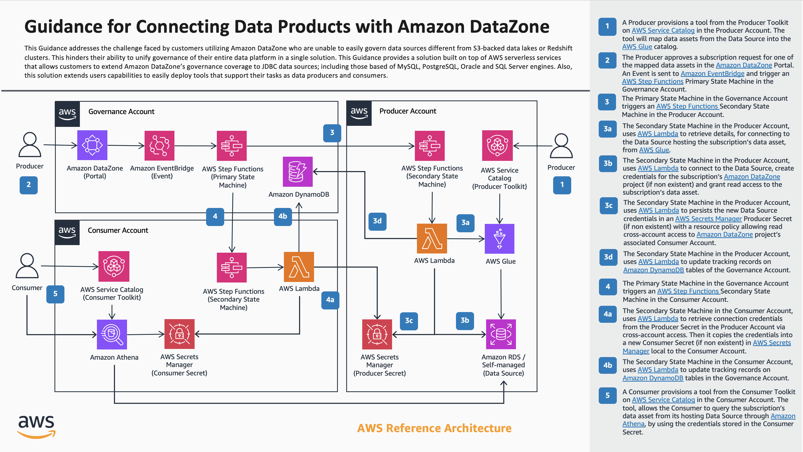

# Guidance for Connecting Data Products with Amazon DataZone

## What problem does this solution solve?

AWS customers are actively building their data governance strategy on top of [Amazon DataZone](https://aws.amazon.com/datazone/), realizing how they can achieve effective governance of their Amazon S3-based Data Lakes and Amazon Redshift clusters. Extending their governance reach to other JDBC data sources like Amazon RDS, self-managed databases or third-party solutions is a common ask once AWS customers experience the benefits of Amazon DataZone. At the end of the day, AWS customers are seeking a unified solution to govern all of their data assets.

## How does this solution solve the problem?

The purpose of this solution is to help customers extend governance with Amazon DataZone and be able to cover common JDBC data sources, so that teams can share and collaborate around data assets hosted in data repositories like Amazon Aurora, MySQL, PostgreSQL, Oracle or SQL Server databases, either on top of RDS or self-managed. 

This solution is built on top of the [AWS Cloud Development Kit (CDK)](https://aws.amazon.com/cdk/) and is designed to be an add-on for Amazon DataZone service that is easy to deploy, extend and customize for any of AWS customers’ needs. It is a fully automated solution that attempts to be seamless from a user experience standpoint, and covers the entire subscription lifecycle.

Although it currently supports MySQL, PostgreSQL, SQL Server and Oracle engine integration, it can be extended to support other SQL and NoSQL databases as well as data warehouse solutions.

## What AWS Services does this solution use?

- [Amazon DataZone](https://aws.amazon.com/datazone/)
- [Amazon EventBridge](https://aws.amazon.com/eventbridge/)
- [AWS Step Functions](https://aws.amazon.com/step-functions/)
- [AWS Lambda](https://aws.amazon.com/lambda/)
- [AWS Secrets Manager](https://aws.amazon.com/secrets-manager/)
- [AWS Key Management Service](https://aws.amazon.com/kms/)
- [AWS Service Catalog](https://aws.amazon.com/servicecatalog/)
- [AWS Glue](https://aws.amazon.com/glue/) 
- [Amazon Athena](https://aws.amazon.com/athena/)
- [Amazon DynamoDB](https://aws.amazon.com/dynamodb/)
- [AWS Lake Formation](https://aws.amazon.com/lake-formation/)

## How does this solution work?

In order to better understand the inner-workings of this solution, lets first list all of the actions that needs to happen before users can collaborate around a data asset hosted in a JDBC source, in a self-service manner, using Amazon DataZone service:

1. A producer needs to create a project with an environment (based on data lake profile) that will host and publish the data asset in Amazon DataZone service.
2. A producer needs to map the data asset into an AWS Glue database. Note that it is recommended to use the AWS Glue database associated to the producer's Amazon DataZone environment.
3. The producer needs to run the Amazon DataZone environment's data source that publishes the data asset into the Amazon DataZone common business catalog.
4. A consumer needs to create a project with an environment (based on data lake profile) that will be used to subscribe and consume the published data asset.
5. A consumer needs to submit a subscription request (with its justification) to get and access grant to the published data asset. This is done from within the consumer's Amazon DataZone project in the Amazon DataZone portal.
6. A producer needs to accept the subscription request in the Amazon DataZone portal, so that access to the data asset is granted to the consumer. Consumer project environments (based on data lake profile) will be added as targets of the subscription automatically or manually by the consumer in the Amazon DataZone portal.
7. A consumer needs to put in place a mechanism that allows for the consumption of the published data asset.

With this high level process in mind, this solution will provide a set of mechanisms that will simplify or automate the activities described above, including:

1. An [AWS Service Catalog](https://aws.amazon.com/servicecatalog/) portfolio hosting a complementary toolkit that can be used in a self service manner, which allow users (producers and consumers) to:

    - Map source data asset hosted in a JDBC source into a target AWS Glue database (associated to an Amazon DataZone environment). (Activity 2)
    - Consume / query a published data asset hosted in a JDBC source after access is granted. This done via an Athena connector (associated to an Amazon DataZone environment).  (Activity 7)

2. A set of automated workflows that will trigger on certain Amazon DataZone events like:
    
    1.  When a new Amazon DataZone environment is successfully deployed so that default environment capabilities are extended to support this solution's complimentary toolkit, described above. (Activities 1 and 4)
    2.  When a subscription request to a published data asset is accepted so that actual access is granted automatically to the corresponding consumer environment. (Activity 6)
    3. When a subscription to a published data asset is revoked / canceled so that actual access is revoked automatically from the corresponding environment.
    4. When an existing Amazon DataZone environment deletion starts, so that non-default Amazon DataZone capabilities are removed from environment.

Note that activities 3 and 5 don't need any complementary task to be executed (automatically nor manually).

The following diagram is the solution's reference architecture illustrating the workflow 2.2 for when a subscription request is approved, described above (which you can consider as the core functionality of this solution). It also illustrates how tools in the solution's toolkit are leveraged by producers and consumers before and after workflow execution.



## How to deploy this solution?

This solution uses [AWS Cloud Development Kit (CDK)](https://aws.amazon.com/cdk/) CLI to automate its deployment. It contains two applications; the first application is intended to be deployed in the central governance account (where Amazon DataZone domain is configured) and second application is intended to be deployed in each of the governed accounts (where data sources are hosted and where producer / consumer project environments will be allocated). 

Each application will be parametrized and deployed separately so that it includes account specific resources like networking and security related.

Note that, you can follow this guide whether you want to deploy the solution in a multi-account environment or a single-account environment. For the latter, just remember that both, governed and governance accounts, should point to the same single account.

### Create virtual environment and install requirements

It is assumed that you have python3 installed already with package *venv* available. To create a virtual environment on MacOS and Linux, execute the following command while standing in the root directory:

``` sh
python3 -m venv .venv
```

After the virtual environment is created, use the following command to activate it as it is needed for next steps in the deployment guide.

``` sh
source .venv/bin/activate
```

Once the virtual environment is activated, you can install the required dependencies. Execute the following command:

``` sh
pip install -r requirements.txt
```

Check that all requirements were successfully installed. Now you can move to the next step.

### Deploy prerequisites in governance and governed accounts

In order to deploy this solution's resources in each of the governed accounts; meaning accounts where Amazon DataZone project environments will be hosted, it is necessary to execute the following steps in each one of them:

#### Bootstrap governance and governed accounts

In order to bootstrap both, the governance and all the governed accounts you need to have an AWS CLI profile for the governance and for each governed account already in place. For more details please review the [AWS documentation](https://docs.aws.amazon.com/cli/latest/userguide/cli-configure-files.html).

Run the following CDK command for the governance and for each of the governed accounts to allocate base CDK resources (known as bootstrapping) in each one of them. Replace ```<PROFILE_NAME>```, ```<ACCOUNT_ID>``` and ```<AWS_REGION>``` with the corresponding profile name, account id and region that maps to the account you are going to bootstrap.

``` sh
cdk bootstrap aws://<ACCOUNT_ID>/<AWS_REGION> --profile <PROFILE_NAME>
```

As part of the bootstrapping process, CDK will create a set of Amazon IAM roles that will be used when deploying resources in your accounts. These can be accessed through the AWS console or using the AWS CLI.

For your governed accounts bootstrap deployments only, take note of the name of the new CDK AWS CloudFormation execution role that was created. The role name should follow the structure *cdk-<RANDOM_VALUE>-cfn-exec-role-<ACCOUNT_ID>-<AWS_REGION>*. There is no need to take note of the role for your governance account.

#### Deploy solution's baseline stack in governed accounts

The baseline stack is an AWS CloudFormation (cfn) stack that extends the capabilities of the CDK AWS CloudFormation execution role so that it is able to perform administrative tasks in AWS Lake Formation.

In order to deploy the baseline stack in each of your governed accounts:

- First you need to make a copy of the the *dz_conn_b_<ACCOUNT_ID>_params.json* file in the *base_environment/params folder*. Note that for each copy of the file, you need to replace the *<ACCOUNT_ID>* tag in the file name with the account id value that maps to the corresponding governed account.
- Include the CDK AWS CloudFormation execution role name of each governed account as value of the parameter *CdkCloudFormationExecutionRoleName* in the governed account's corresponding file as shown in the following example.

``` json
[
    {
        "ParameterKey": "CdkCloudFormationExecutionRoleName",
        "ParameterValue": "cdk-<RANDOM_VALUE>-cfn-exec-role-<ACCOUNT_ID>-<AWS_REGION>"
    }
]
```
- While standing on the root folder execute the following command, replacing ```<PROFILE_NAME>``` and ```<ACCOUNT_ID>``` with the corresponding values of AWS CLI profile and account id corresponding to the governed account where baseline resources will be deployed:

``` sh
sh base/deploy.sh -p <PROFILE_NAME> -a <ACCOUNT_ID>
```
- Wait till completion and then check the AWS console for an AWS CloudFormation stack named *dz-conn-base-env* containing required AWS Lake Formation permissions.

Remember that this process must be done for all governed accounts. Once finished, you can move to the next step.
Note that this step is not necessary to be performed in your governance account.

### Deploy solution's resources in governance account

this solution is a solution that includes two CDK applications. 1/ An application containing all resources for the single central account that will govern your Amazon DataZone setup and 2/ an application containing all resources to be deployed in each of your governed accounts. First, you need to deploy resources in your central governance account as described next.

#### Setup config file for your central governance account

The json file located in the *config/governance/g_config.py* path contains the configuration parameters to setup your governance account deployment.

Edit the file and include values for *GOVERNANCE_PROPS* dictionary with the corresponding values of you governance account. Please follow the file's documentation for better understanding of each of the keys in the *GOVERNANCE_PROPS* dictionary:

``` python
GOVERNANCE_PROPS = {
    'account_id': '',
    'region': '',
    'a_account_numbers': [],
}
```

#### Deploy governance CDK app in governance account

Execute the following command to deploy governance CDK app, replacing <PROFILE_NAME> with the AWS CLI profile name mapping to your governance account:

``` sh
cdk deploy --app "python app_governance.py" --profile <PROFILE_NAME> --all
```

The CDK application will retrieve of values specified in the configuration file of your governance account (filled in last step) and deploy resources based on them.

Approve Amazon IAM resource deployment as required by the CDK deployment process in your terminal.

You will be able to see the progress of the deployment in your terminal and [AWS CloudFormation console](https://console.aws.amazon.com/cloudformation/home?) of your governance account. When finished check that deployment was successful.

Now you can move to the next step.

### Deploy solution's resources in all governed accounts

Now, you need to deploy resources in each of your governed accounts. In order to do so you need to repeat the steps described next for each of the governed accounts in you Amazon DataZone setup.

#### Setup config file for a governed account

First, you need to make a copy of the the *a_<ACCOUNT_ID>_config.json* file in the *config/account* replacing the *<ACCOUNT_ID>* tag in the file name with the account id value that maps to the corresponding governed account.

Second, go through each of the dictionaries in the copied python file. Assign a value to each of the keys in all dictionaries based on the file's documentation and your governed account specific setup.

Note that *ACCOUNT_PROPS* is a core dictionary that is mapped by other dictionaries in the same file. Remember that even though some of the dictionary values are pre-assigned, this is for illustration purposes only so that you are aware of how you can reference core variables from within your dictionaries.

You need to review and assign each of the values in all dictionaries before you proceed to the next step. All keys in all dictionaries must have non-null values for deployment to be successful (unless specified in the file's documentation).

#### Deploy governed CDK app in a governed account

Execute the following command to deploy account (governed) CDK app, replacing ```<PROFILE_NAME>``` and ```<ACCOUNT_ID>``` with the AWS CLI profile name and account id mapping to your governed account:

``` sh
cdk deploy --app "python app_account.py" --profile <PROFILE_NAME> -c account=<ACCOUNT_ID> --all
```

The CDK application will retrieve of values specified in the configuration file of your governed account (filled in last step) and deploy resources based on them.

Approve Amazon IAM resource deployment as required by the CDK deployment process in your terminal.

You will be able to see the progress of the deployment in your terminal and [AWS CloudFormation console](https://console.aws.amazon.com/cloudformation/home?) of your governed account. When finished check that deployment was successful.

Remember that you need to repeat steps 3a and 3b for each of your governed accounts. When finished, you will be done with the deployment of the solution.

## How to uninstall this solution?

### Before uninstalling this solution

Note that before uninstalling this solution it is recommended to:
1.  Revoke access to all assets hosted by JDBC sources that were granted via this solution, because created secrets in AWS Secrets manager during grant workflow will not be deleted when deleting the solution, nor created users associated to consumer environments in each of your source dbs will be removed. 
    * It is recommended to do this via the Amazon DataZone portal.
    * You can verify that all subscription related assets were removed by checking Amazon DynamoDB items, remaining secrets in AWS Secrets Manager and remaining users in your source dbs.
2. Execute the *dz_conn_g_manage_environment_delete* state machine in your governance account for each of the environments created after this solutions installation, because environment roles need to be left as were originally deployed by Amazon DataZone (cleaned); meaning, without the capability / permission extensions that this solution added when environments were created.
    * If not done, it can bring unexpected errors later when trying to delete environments using the Amazon DataZone portal.
    * To execute the workflow, start a new execution of the *dz_conn_g_manage_environment_delete* state machine in the [AWS Step Functions](https://us-east-1.console.aws.amazon.com/states) console of your governance account using the following input and replacing ```<AMAZON_DATAZONE_DOMAIN_ID>```, ```<AMAZON_DATAZONE_PROJECT_ID>``` and ```<AMAZON_DATAZONE_ENVIRONMENT_ID>``` with the corresponding values for the environment that you are going to clean:

    ``` json
    {
        "EventDetails": {
            "metadata": {
                "domain": "<AMAZON_DATAZONE_DOMAIN_ID>"
            },
            "data": {
                "projectId": "<AMAZON_DATAZONE_PROJECT_ID>",
                "environmentId": "<AMAZON_DATAZONE_ENVIRONMENT_ID>",
                "delete": true
            }
        }
    }
    ```

### Uninstalling the application in each of the governed accounts

The following steps should be repeated per each governed account in your setup:

* Sign in to the [AWS CloudFormation console](https://console.aws.amazon.com/cloudformation/home?).
* On the Stacks page, go through the following stacks in the suggested order and choose Delete for each one of them. It is recommended to wait for deletion of each stack before moving to the next. 
    * *dz-conn-c-service-portfolio-stack*
    * *dz-conn-p-service-portfolio-stack*
    * *dz-conn-c-workflows-stack*
    * *dz-conn-p-workflows-stack*
    * *dz-conn-p-common-stack*
    * *dz-conn-a-common-stack*

### Uninstalling the application in the governance account

* Sign in to the [AWS CloudFormation console](https://console.aws.amazon.com/cloudformation/home?).
* On the Stacks page, go through the following stacks in the suggested order and choose Delete for each one of them. It is recommended to wait for deletion of each stack before moving to the next. 
    * *dz-conn-g-workflows-stack*
    * *dz-conn-g-common-stack*

### Uninstalling solution’s prerequisites

The following steps should be repeated per each governed account in your setup:

* Sign in to the [AWS CloudFormation console](https://console.aws.amazon.com/cloudformation/home?).
* On the Stacks page, select the  *dz-conn-base-env* stack.
* Choose Delete.

## What costs can I expect when using this solution?

The following table provides a sample cost breakdown for deploying this solution with the default parameters in the US East (N. Virginia) region for one month.

The estimate presented bellow assumes the following usage-pattern:

- Number of governed accounts: 10
- Number of secrets (subscriptions to JDBC sources): 100
- Number of project environment related workflow (creation / deletion) executions in a month:  20
- Number of subscription related workflow (grant / revoke) executions in a month: 200
- Number of AWS Glue crawlers executions in a month: 1500
- Average execution time of AWS Glue crawlers in minutes: 2 
- Number of Amazon Athena queries on top of JDBC sources in a month: 20.000
- Average execution time of an Amazon Athena query in seconds: 7
- Average data volume (in MBs) scanned by Amazon Athena per query: 10

However, each customer has its own specific usage-pattern driven by number of users, teams, and data assets that they will be collaborating on. 

The cost estimate will be divided in two sections. Section 1 illustrates costs for this solution itself and resources supporting its core capabilities. Section 2 illustrates costs for user activity related to producing and consuming data assets. These costs needs to be assessed individually.

### Section 1

The majority of the monthly cost is dependent on AWS Secrets Manager and AWS Key Management Service. Note that these services costs are low in comparison to the big impact they have on solution’s security posture. 

| AWS Service    | Dimensions | Cost (USD) |
| -------- | ------- | ------- |
| AWS Step Functions | 220 workflow requests per month with 5 average transitions per request | $0.00 |
| AWS Lambda | 1100 requests per month with average duration of 200 ms and 128 MB memory | $0.00 |
| Amazon DynamoDB | 3 GB of total storage and 600 writes per month of on demand capacity | $0.76 |
| AWS Key Management Service | 10 CMKs serving 400 symmetric requests per month | $10.00 |
| AWS Secrets Manager | 100 secrets serving 21000 API calls per month | $40.10 |
| Amazon EventBridge | 220 custom events per month | $0.00 |

### Section 2

The majority of the monthly cost is dependent on AWS Glue Crawlers. Note that these services are associated to tasks that users need to perform to operate on top of Amazon DataZone and that are not a requirement for the solution. Customers have the option to deploy this resources via the toolkit provided in this solution or by any other means they have available.

| AWS Service    | Dimensions | Cost (USD) |
| -------- | ------- | ------- |
| AWS Glue | 1500 crawler executions with 2 minutes average execution time | $26.40 |
| Amazon Athena | 20000 queries per month scanning 10 MB of dta in average per query | $0.95 |
| AWS Lambda | 20000 requests per month with average duration of 7000 ms and 128 MB memory | $0.76 |

## What is the security posture of the this solution?

When you build systems on AWS infrastructure, security responsibilities are shared between you and AWS. This [shared responsibility model](http://aws.amazon.com/compliance/shared-responsibility-model/) reduces your operational burden because AWS operates, manages, and controls the components including the host operating system, the virtualization layer, and the physical security of the facilities in which the services operate. For more information about [AWS security](http://aws.amazon.com/security/), visit AWS Cloud Security.

### Amazon IAM roles

Amazon IAM roles allow customers to assign granular access policies and permissions to services and users on the AWS Cloud. This solution creates Amazon IAM roles that grant the solution’s resources perform actions on other regional resources. Additionally it uses resource policy to restrict access to shared resources between accounts.

Cross-account access is done via cross-account roles with limited permissions that allow only intended actions. This pattern is used both ways, accessing governed accounts from governance central account and otherwise.

### AWS KMS keys

The this solution will deploy AWS KMS customer managed keys (one per account) to encrypt secrets used to share credentials. We recommend referring to [Security best practices for AWS Key Management Service](https://docs.aws.amazon.com/kms/latest/developerguide/best-practices.html) to enhance the protection of your encryption keys.

### AWS Secrets Manager

Secrets are the core means by which the this solution enables data sharing and collaboration between producers and consumers on top of JDBC hosted data assets. Access to secrets are protected by resource policies and contents are encrypted by account specific CMKs in AWS KMS. Secrets are deleted when not needed by the solution.

## License

This library is licensed under the MIT-0 License. See the LICENSE file.